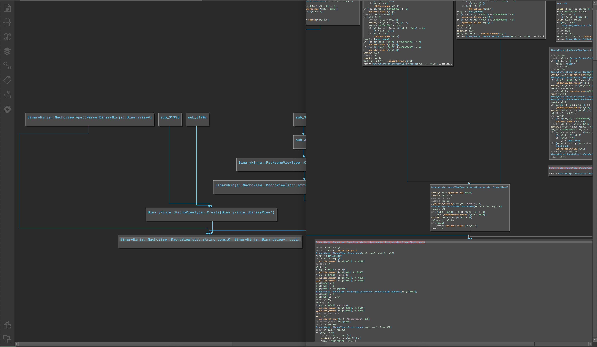

# binaryninja-callgraph

Dead simple callgraph plugin for BinaryNinja. Quickly gain understanding of a program's control
flow with a few keystrokes.

---

<p align=center>

</p> 

---

Supports generating callgraphs with HLIL included or solely with names

Can generate a graph `N` calls into a func, out of a func, a variable amount in both directions, or of the entire program.

Runs entirely backgrounded and uses exclusively BinaryNinja APIs for a seamless and snappy integration into the product.

### Build

```shell
mkdir -p build && cd build
# For headless builds, omit -DUI_BUILD=ON argument entirely or set it to OFF
# This plugin is UI only and this option is only given for consistency, 
#   this plugin is completely useless without the UI_BUILD flag (it will build though!).
cmake -DCMAKE_BUILD_TYPE=Release -DUI_BUILD=ON ../
cmake --build . --target=install -j 8 
```

---

<p align=center>

</p> 
<p align=center>
plugin by cynder
</p>
<p align=center>
part of the <a href="https://github.com/cxnder/ksuite">ksuite</a> toolkit
</p>
